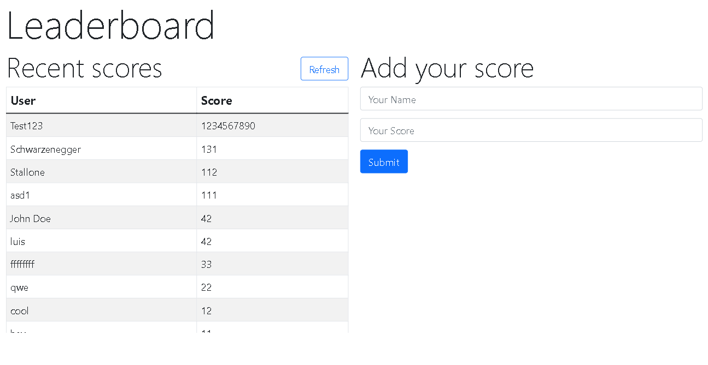

 [](https://hits.seeyoufarm.com)

# Leaderboard

> Leaderboard project.

## Preview



## Built With

- HTML & CSS
- Bootstrap
- Javascript
- Webpack

## Live Demo

[Live Demo Link](https://lfmnovaes.github.io/leaderboard/)

## Getting Started

- Run git clone on this project at the desired directory:
   ```
   git clone https://github.com/lfmnovaes/leaderboard.git
   ```
- Run `npm install` to install the necessary packages to run locally
- After installing everything, run `npm start` and your default browser will open with the page

### Prerequisites

An updated web browser

### Usage

- Add your name and your score in the right side form to add to the leaderboard. (Not implemented yet)

## Authors

👤 **Luís Fernando**

- GitHub: [](https://github.com/lfmnovaes)
- Twitter: [](https://www.twitter.com/lfmnovaes/)
- LinkedIn: [](https://www.linkedin.com/in/lfmnovaes/)

## 🤝 Contributing

Contributions, issues, and feature requests are welcome!

Feel free to check the [issues page](../../issues/).

## Show your support

Give a ⭐️ if you like this project!

## Acknowledgments

To everyone in Microverse.

## 📝 License

This project is [MIT](./LICENSE) licensed.
